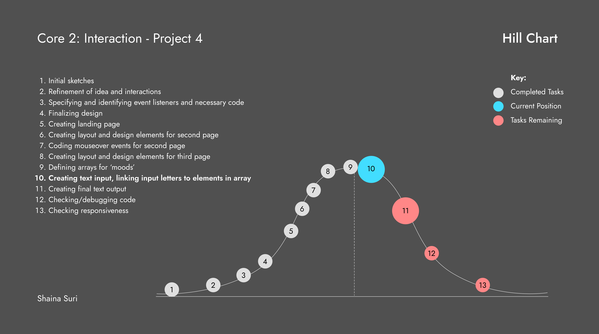

<h1>Description of Project:</h1>

This interactive web experience is intended to help users with the common problem of deciding what to eat during the day. This project plays with the concept of hanging around your fridge, trying to make a decision about your next meal or snack. It is intended to let users play with this interactive site to get ideas about what they can eat.

This site is made of three pages. The first page is a simple introductory landing page. The main door handle allows the users to 'open' the fridge to see what's inside.   
Inside, on the second page, is the interior of the fridge, where users can mouse over the containers shown to get ideas of various cuisines they can consider having. To navigate to the next page, they would have to click on the "more options" button. There is also an option to 'close' the fridge, which would take them back to the home page.   
The "more options" button would take them to the final page, which would show the side of the fridge. Here, they would be prompted to pick their 'mood' from the options presented like fridge magnets. Each of these magnets are categories that have arrays with various food options as elements within them. 
The idea is that once they choose an option, the next prompt would appear asking them to input their name.  
Then once they input their name and hit enter, one final text box would appear giving them a personalized food choice idea. This final result would show one element from the array of the category they chose. I'm thinking of picking the item based on the number associated with first letter of their names. <b>(this is the main challenge I need to work through)</b>

<h5>Link to Figma Sketches for reference:</h5>
<a href="https://www.figma.com/file/Bk1rpm1aEein6Lww40dyHn/Project-4-Sketches?node-id=0%3A1">